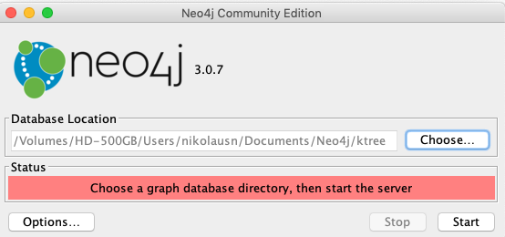
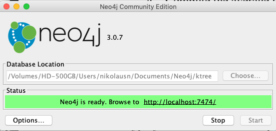
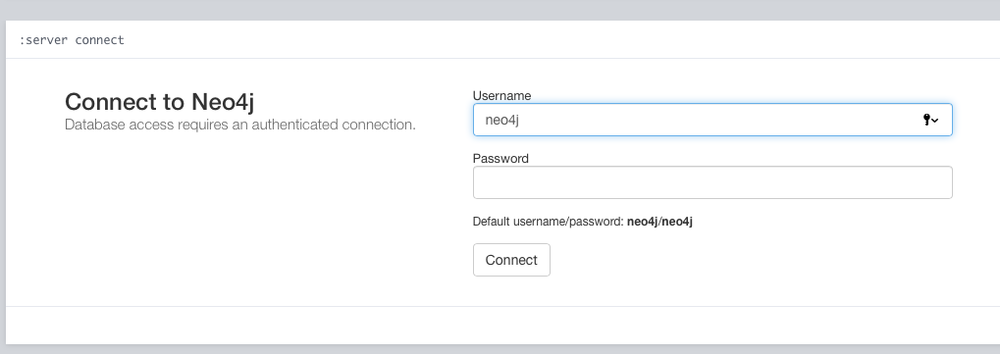
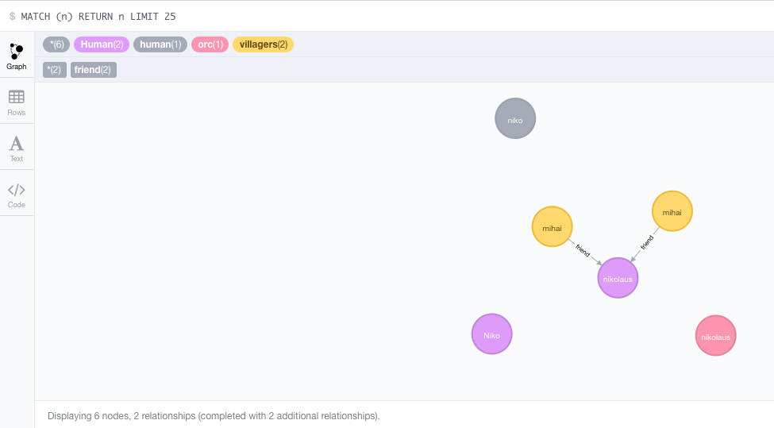

# Tree of Knowledge

A crowdsourced, gamified, and fact-checked knowledge sharing platform that can
be filtered by cause and location so that seemingly
complex topics/systems/information can be conveyed in an easy-to-understand,
simple, and standardized way.

# How to Run

## Prerequisites
1. Clone this repository
1. Install the latest versions of npm and Node

## Install Neo4J Graph Database
The Tree of Knowledge uses Neo4J for storing graph database.
The Neo4J installer can be found in
https://neo4j.com/download-center/#releases
We used Neo4J community edition during development of this software
Starting Neo4J is easy. After installing you can choose the location (folder) in which you want to store the database, and click start button to start the server.

If it runs successfully the Neo4J server interface will notify that Neo4J server is running and Web Admin ready to be accessed on http://localhost:7474

Access the neo4j web admin by clicking the URL. To enter the Admin page you can enter the default user/password neo4j/neo4j for the first time, You need to change the password, for this prototype we assign the password to ktree4j.

By default the bolt Neo4J protocol will run on port 7687 in which NodeJS server will have connection to.

That's it, now Node Backend server can connect to the Neo4J server using the Bolt Neo4j Protocol.

## Install and Run Backend Node Server
1. Browse to the `tree-of-knowledge/backend/node-server/` directory
1. Run `npm install` to install packages/dependencies
1. Execute `nodemon app.js` to launch back-end server  (uses porn 3001)

## Install and Run Frontend React Client
1. Browse to the `tree-of-knowledge/client/react-app/` directory
1. Run `npm install` to install packages/dependencies
1. Execute `npm start` to launch the client

## View the End Result
1. Browse to `https://localhost:3000` and voila!
